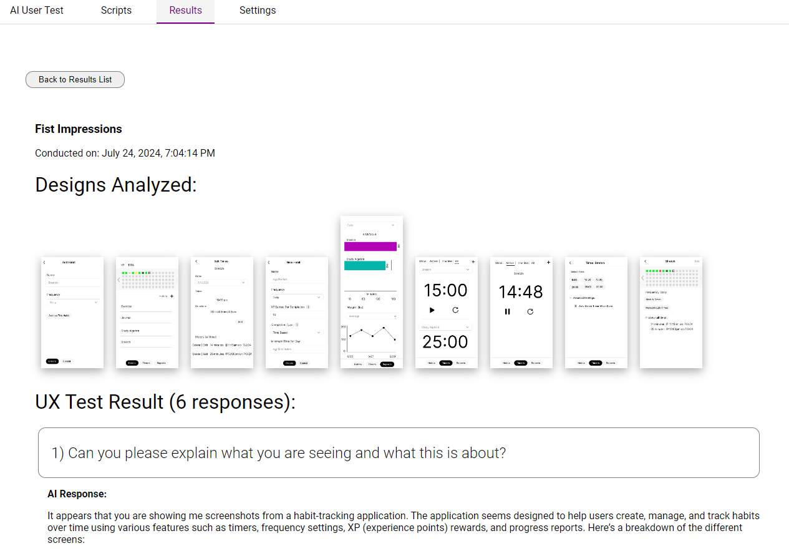

# AI User Testing Tool

https://github.com/user-attachments/assets/805345e0-0438-4dcf-90cb-74ae983313a7

Welcome to the AI User Testing Tool! This project is designed to help you get initial feedback on your designs using a simulated user powered by AI. It's perfect for a first pass before conducting real user testing, helping you refine the questions you want to ask to get the feedback you need.

## [YouTube Video Demo:](https://youtu.be/qLzIfeARKwI)

-----

   

# Screenshots:

### Editing Scripts:
  

 -----

-----

   
### Sample Test Result:
  
 
 -----

 
 -----
 
   

## Setting Up & Running the Project
Please run both the frontend and backend projects. First the backend project, then the frontend should start on port 3001.
They each have their own READMEs.

### OpenAI API Key:

You will need OpenAI API key.

## Thanks for looking!

