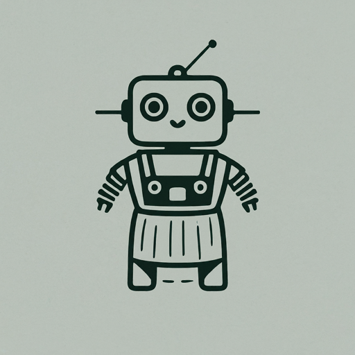

# Welcome!

## Setup
Please run both the frontend and backend projects. First the backend project, then the frontend should start on port 3001.
They each have their own READMEs.

# Overview
]
]

## Thanks for looking!

]
